# :clapper: 2022 Movie Website Project :slot_machine:

SSAFY 1학기 최종 프로젝트 : 커뮤니티 기능을 갖춘 영화 추천 웹 서비스를 구현하며 작성하였습니다. 


[TOC]


### 1. 프로젝트 기간 및 목표

---

- 2022.05.17(화) ~ 2022.05.26(목)
- 영화 추천 알고리즘을 적용한 영화 커뮤니티 사이트 구현 


### 2. 팀 정보 및 업무 분담 내역

---

#### 눈물 날 정도로 약한 서`상`균 박지`현의` `4`조 


| 이름                  | 역할         | 업무 분담 내역                                     |
| --------------------- | ------------ | -------------------------------------------------- |
| 서상균 :feet:         | 팀장         | Back-end / Django 서버 구현 / Vue 클라이언트 구현  |
| 박지현 :purple_heart: | 팀원, 젼버덕 | Front-end / Vue 클라이언트 구현 / Django 서버 수정 |


### 3. 개발일지

---

| 날짜       | 진행                    | 내용                                                         |
| ---------- | ----------------------- | ------------------------------------------------------------ |
| 2022-05-16 | 기획                    | 기능 기획                                                    |
| 2022-05-17 | 기획                    | 기능 구체화, 디자인 컨셉 선정, 수집 필요한 데이터 정리       |
| 2022-05-18 | 기획                    | API docs 구성, 목업 작성, 컴포넌트 구조 작성, 영화 데이터 수집 |
| 2022-05-19 | 기획                    | 목업, DB 모델링, ERD 작성 완료, 영화 데이터 수집, Django 프로젝트 설정 |
| 2022-05-20 | 개발                    | **Front**<br />- 프론트 프로젝트 생성<br />- 컴포넌트 생성, router 링크 작성<br />- vuex store 모듈화<br />**Back**<br />- API url 정리<br />- 데이터 가공 및 전송 로직 작성 |
| 2022-05-21 | 개발                    | **Front**<br />- Account login, logout, signup<br />**Back**<br />- Front 개발 단계에 맞춰 로직 수정<br />- 데이터 가공 및 전송 로직 작성 |
| 2022-05-22 | 개발                    | **Front**<br />- Account profile, user update<br />- Community  create<br />**Back**<br />- Front 개발 단계에 맞춰 로직 수정<br />- 영화 추천 알고리즘 작성 |
| 2022-05-23 | 개발                    | **Front**<br />- Community comment, article 전체 완성<br />- Movie search, detail (박지현)<br />- Movie recommend (서상균)<br />**Back**<br />- Front 개발 단계에 맞춰 로직 수정 |
| 2022-05-24 | 개발                    | **Front**<br />- Casino quiz, back gacha, card gacha (서상균)<br />-  개발 완료된 기능 스타일링<br />**Back**<br />- Front 기능 수정에 맞춰 로직 수정 |
| 2022-05-25 | 개발, 디버깅            | **Front**<br />- 개발 완료된 기능 스타일링<br />- 추가 기능 구현 : <br />[완성]<br />Profile 페이지 배우 카드 정렬, Alert 수정 <br />[미완성] <br />Article에 카드 첨부 |
| 2022-05-26 | 개발, 디버깅, 발표 준비 | **Front**<br />- 개발 완료된 기능 스타일링<br />- 추가 기능 구현 <br />[완성]<br />Profile 배우 카드 누르면 배우 정보 나오게 설정 (서상균) |


### 4.  개발 툴

---

- Git을 통한 소스코드 버전 관리 및 협업 
- Jira를 통한 프로젝트 일정 및 자료 관리
  - 

- Figma를 통한 목업 작성
  - 

- Python Web Framework
  - Django 2.1.x
  - Python 3.6.x
- JavaScript Framework 
  - Vue 2.x


### 5. 프로젝트 컨셉 및 주요 기능 

---

#### 5-1. 컨셉

- 카지노 컨셉의 영화 커뮤니티 사이트 
- 글, 댓글 작성, 영화 퀴즈를 통해 포인트를 벌어서 배경, 배우 카드 뽑기를 진행할 수 있다! 
  - 소비자의 수집욕구를 겨냥해 활발한 커뮤니티 기능 사용 유도  


#### 5-2. 영화 추천 알고리즘과 기능 요약

- 추천 알고리즘

  - 영화 장르별 추천 알고리즘
  - 다양한 장르의 유명 영화들을 랜덤으로 12개씩 제공
  - 평점 필터링 / 장르 필터링

   

- 주요 기능

  - 영화 : 영화 추천 및 검색, 간단한 정보 제공
  - 커뮤니티 : 게시글 작성 및 게시글 안에 댓글 작성 기능
  - 카지노 : 포인트 획득할 수 있는 퀴즈, 배경 및 카드 뽑기
  - 프로필 : 현재 포인트, 뽑은 배경, 작성한 글, 보유 카드 확인 가능


### 6. 컴포넌트 구조

---


### 7. 데이터베이스 모델링

---


#### 7-1. Accounts 모델 클래스 user

- (1:N)
- (M:M)

```
상균님 이 부분 작성 원하시면 작성해주시면 댑니다 ... 안쓸건데? 하면 그냥 지워주세요
```


### 8. 구현한 기능

---


#### 8-1. 시작 화면 

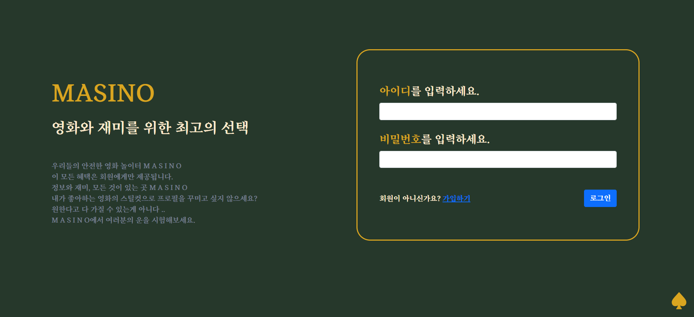

- 로그인 화면
  - 로그인 해야만 모든 서비스를 이용할 수 있다.
  - 완성 전 버전이어서 글이 이상하게 들어가있음
  - 회원이 아니라면 가입창 링크로 연결 
  - 일치하지 않는 항목 / 로그인 오류가 나는 경우에 alert가 뜬다


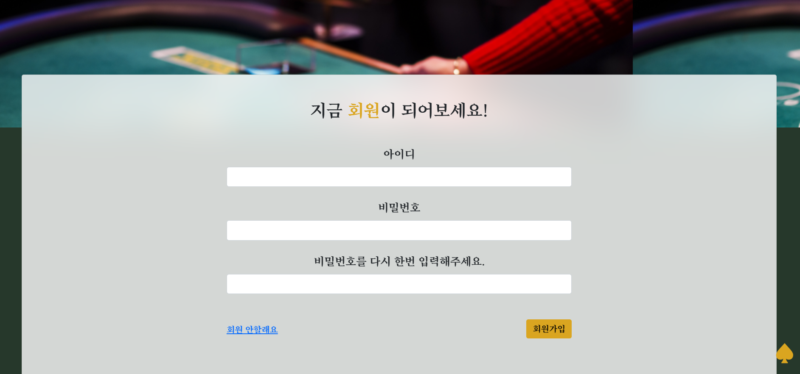

- 회원가입
  - 일치하지 않는 항목이 있으면 alert가 뜬다.


#### 8-2. 메인 페이지

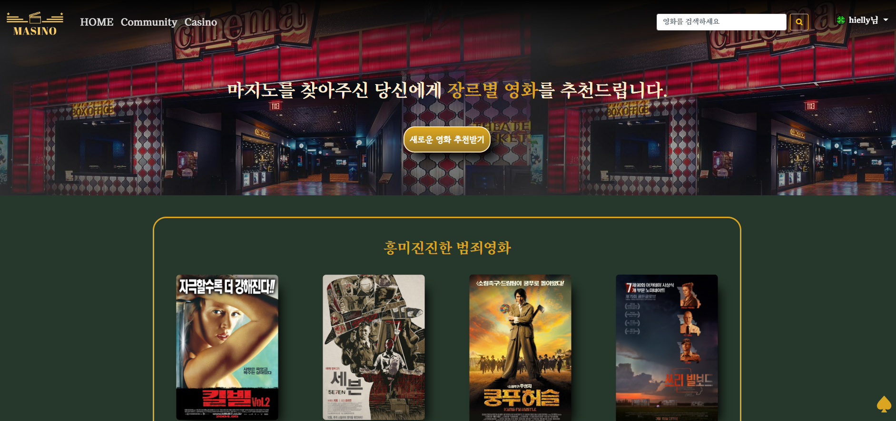

- 영화 추천 페이지, 새롭게 추천 받기 버튼이 메인에 위치
  - 각 영화의 포스터를 누르면 영화 세부 정보로 이동
  - 오른쪽의 스페이드는 Back to Top 버튼 : 누르면 페이지의 가장 위로 이동한다
  - navbar의 검색창을 통해 언제든지 영화 검색이 가능하다 

- 영화 추천 알고리즘
  - 1차로 평점 순으로 영화를 받아온다 
  - 2차로 보여줄 때 장르로 분류해 추천한다.


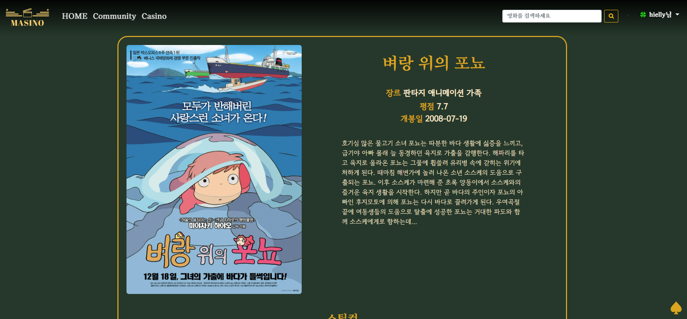

- 영화 디테일 페이지 
  - 포스터, 제목, 장르, 평점, 개봉일, 줄거리, 썸네일이 포함된 영화 세부 정보 페이지 


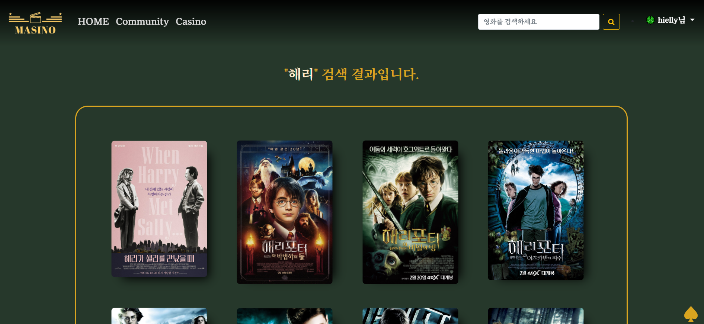 

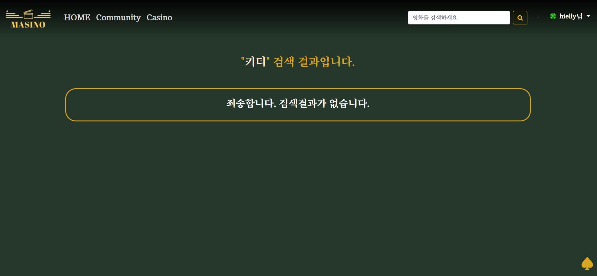

- navbar의 검색창으로 검색했을 때의 결과
  - 검색결과가 없을 경우에 알리는 문구가 표시된다.
  - 검색된 영화를 누르면 영화 세부 정보로 이동 


#### 8-3. Community

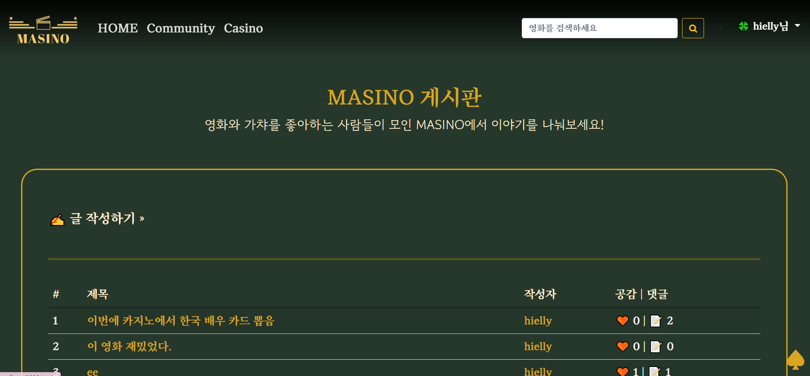

- 게시판 메인
  - 글 작성 페이지, 작성된 글들이 표시된다.
  - 제목 => 글 디테일, 작성자 => 해당 작성자의 프로필로 이동한다.


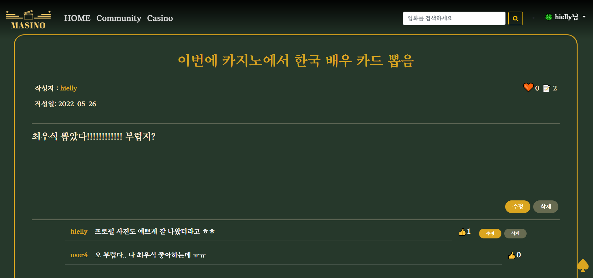

- 글 디테일
  - 작성자 (누르면 프로필로 이동), 작성일, 공감, 댓글 수, 글 내용, 댓글과 댓글 작성폼이 포함된다.
  - 글 내용 부분은 스크롤 설정해둬서 일정 크기보다 커지면 자동 스크롤 


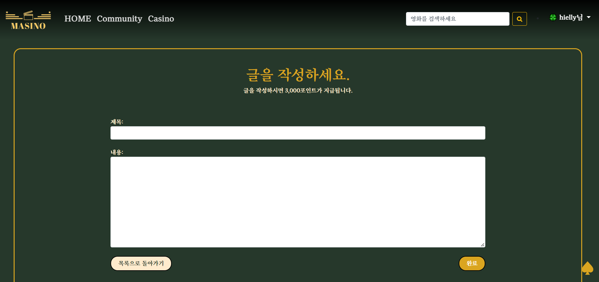

- 글 작성 / 수정 페이지 (같은 폼을 사용한다)
  - 제목, 내용 입력
  - 작성시 완료를 누르면 포인트가 들어왔다는 창이 뜬다.


#### 8-4. 카지노

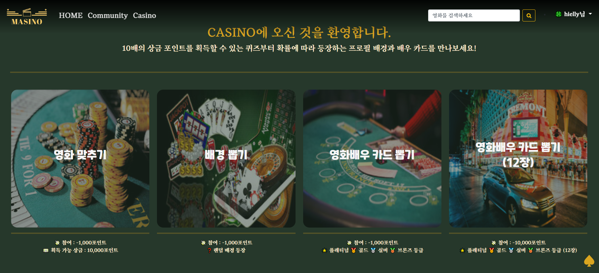

- 포인트 획득 퀴즈 / 뽑기 3 종류로 이루어짐
  - 영화 맞추기 -> 스틸컷을 보고 영화 제목을 맞추면 10,000 포인트 획득 가능 
  - 배경 뽑기 => 랜덤으로 배경을 뽑아 나의 프로필에 설정할 수 있다
  - 카드 뽑기 (1장, 12장) => 배우 카드를 뽑을 수 있다. 총 4가지 등급(유명도 순)으로 나뉘어진다.


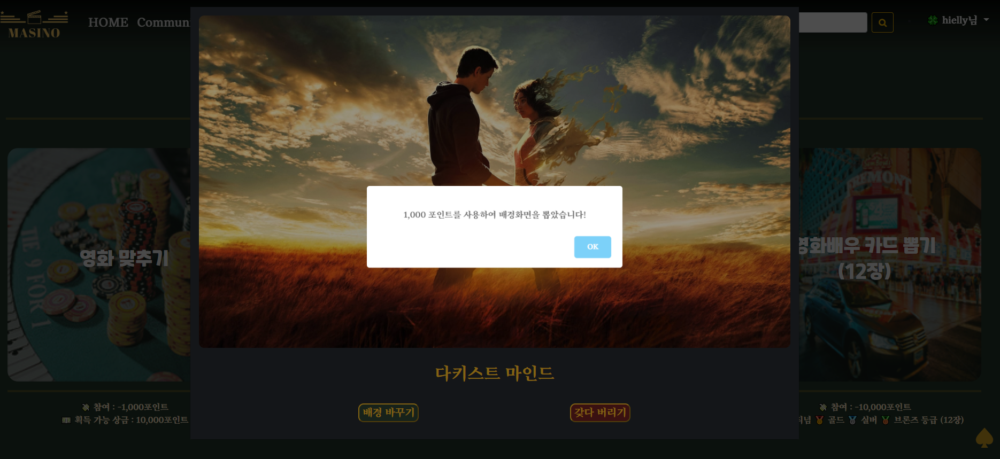

- 예시는 배경 뽑기 ..
  - 퀴즈 맞추거나 뽑을 때마다 획득 알림이 뜬다 


#### 8-5. 프로필

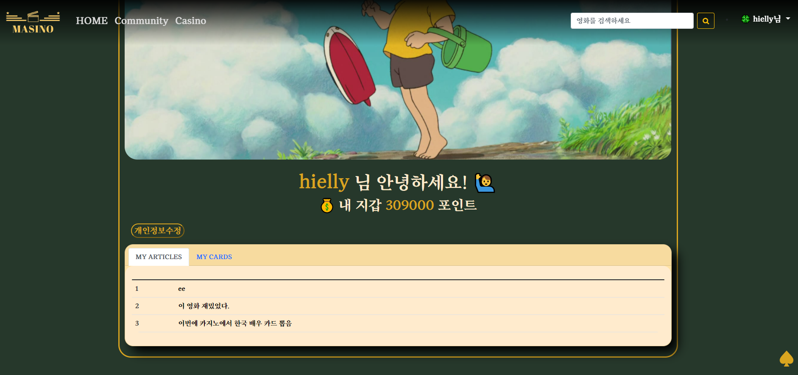

- 내가 뽑아서 설정한 배경화면
  - 배경화면이 없는 경우에는 안내문구와 카지노로 가는 링크 연결 
- 아이디, 현재 가지고 있는 포인트, 개인정보수정 (이메일 하나), 작성글, 가지고 있는 카드들 포함
  - 글 제목을 누르면 글 디테일로 이동한다.

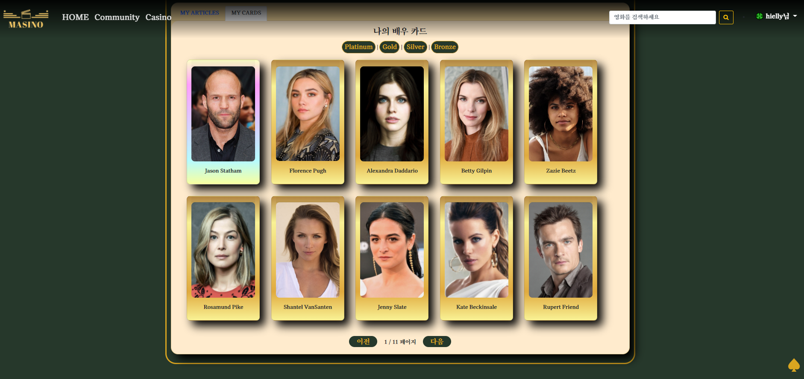

- 내 배우 카드 
  - 등급 순서대로 정렬 (기본)
  - 위의 버튼을 통해서 등급별로 볼 수 있다
  - 카드를 누르면 해당 배우의 정보가 담긴 모달창 


### 9. 아쉬웠던 점 ..

---

- article에 배우 카드 넣는거 꼭 하고 싶었는데 구현하지 못했다 ㅜㅜ 
  - MTM POST 요청 보내기
- article pagination 적용 못한 점 
- article 좋아요 유무에 따른 버튼 다르게 보이기
  - 빈하트 / 꽉찬하트 
-  error 창이 자꾸 localstorage에 저장되는지 alert가 계속 발생하는 문제 해결 못한 점


### 오류가 키워 준 지식 :v:

---

- module을 나눠서 사용하면 다른 파일들은 `new Vuex.Store` 붙일 필요 없이 그냥 `export default ({})` 로 작성하면 된다! 이미 index가 생성해뒀기 때문! 
  - 
  - Uncaught Error가 뜬다!

---

- template 부터 위에서 아래로 렌더링 된다 .. props 데이터를 템플릿에서 쓰려고해서 문제가 생겼다 .... 큰 문제가 .. 
  - 이전 코드 : getters를 써서 state에 있는 pk 값을 data에 집어넣어서 사용하려고 함. 
    - undefined 오류가 뜸
    -  
    - 이름만 다르고 같은 오류가 뜸
    - **속성이 선언되지 않았는데 화면에 렌더링 되려고 했습니다**
  - 해결 방법 
    - 1. props에 userPk 값을 넣어서 받아올 수 있나 확인
      2. main view 에서 router-link params를 1번에서 성공한 값으로 넣어서 path가 문제인지 데이터 값이 문제인지 체크
      3. 데이터가 문제였다 ... 
      4. data에 담아서 넘기던 코드를 computed를 사용해 넘겨줌! 
      5. params값이 string으로 들어가는 문제 발생 ...
    - **코드 싹 지우고 .... profile 페이지에서 userPk 싹 빼서 처리**
      - **dj-rest-auth  사용해서 request에 이미 정보가 담겨있었다.** 

---

- Pk 값에 대체 무슨 문제가 있던 걸까요 
  - 
  - article 작성 됨 => article Detail로 이동해야하는데 articlePk값이 없다고 한다 ,,, 하지만 getters.article.id 에 분명 값이 잘 들어있고요? 
  - 모든 코드에서 pk값이 말썽을 부리는 문제가 발생합니다 ......
  - 이거.. 아마 router.params에서 꺼내서 해결 했던 것 같습니다.

---

- 댓글이 생성은 되는데요? 이게 좀 이상합니다
  - 
  - 1. 댓글을 새로 작성하면 위처럼 댓글들이 다 뜬다 (방금 새로 작성한 댓글은 제외....)
    2. 새고하면 다른 댓글들은 다 지워지고 => 해당 article에 속한 댓글만 잘 뜬다... 
    3. 생성 / 수정 / 좋아요에서 같은 문제 발생
  - 수정이 진행되면 수정된 정보를 보내줘야하는데 시리얼라이저 맨 앞에서 받아온 애들을 넘겨주면 수정이 반영이 안된다... 그래서 return 해주기 전에 수정된 정보들을 다시 받아서 serialize 시킨 후 반환!
  - 

---

- Pk값을 찾지 못할 때는 내가 값을 제대로 찾아서 넣어줬는지 확인하자... 

---

- 새로고침 할 때 NavigationDuplicated 오류가 뜬다.. 

  - 기능은 작동하지만 자꾸 오류가 나서 ..... 이런식으로 catch err => err 해줬다... (aka 비둘기코드)
  - Error Handling
    - 에러 핸들링 미들웨어라고한다 .. 

  ```js
          router.push({
            name: "moviesearchview",
            params: {
              keyword: getters.keyword,
            },
          }).catch(err => err)
  ```


---

- 기타 스타일링 하면서 알게 된 여러 사실들
  - 버튼 테두리 border - 0
  - background-color 대신 background 써볼 것
    - navbar 색 설정하면서 알게됨
  - 어디서 어디로 어느 데이터 보내주는지 먼저 잘 파악할 것!
