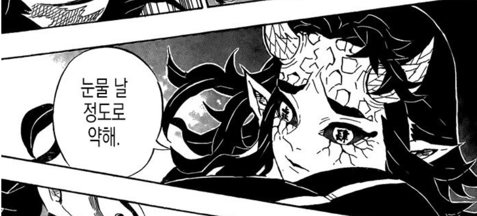
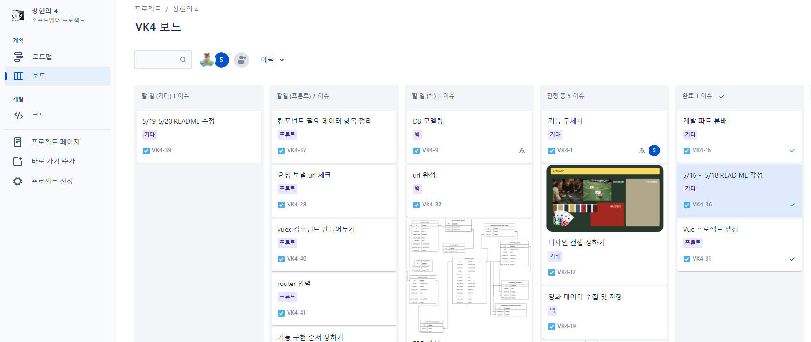
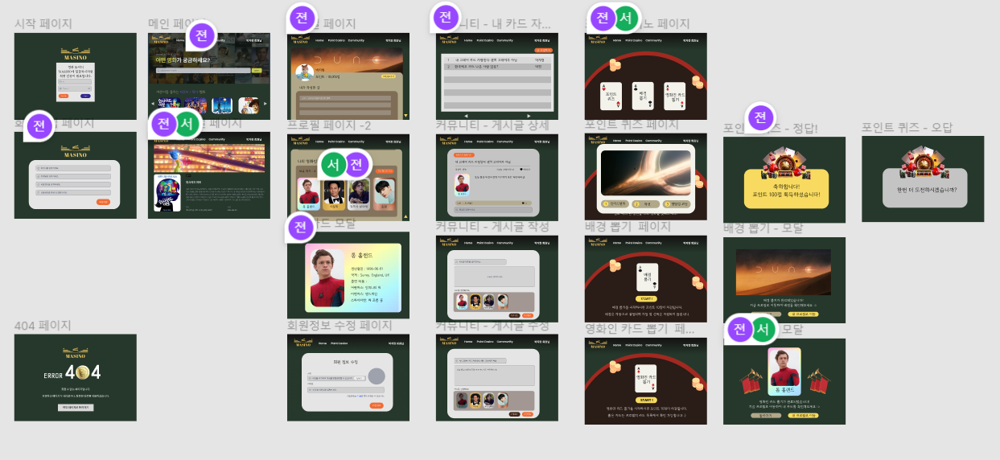
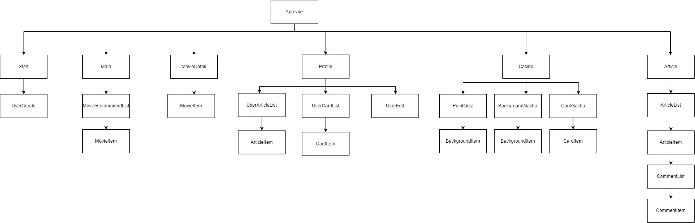
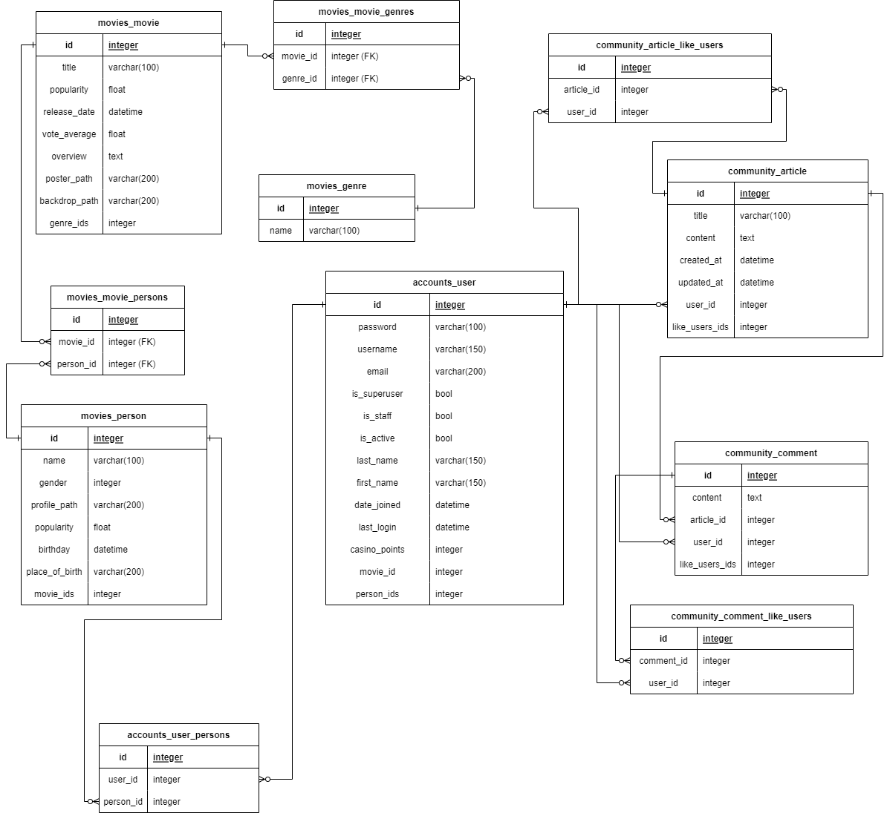
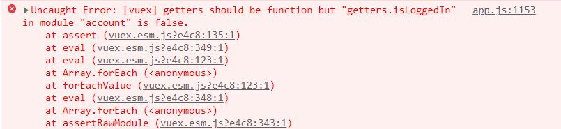
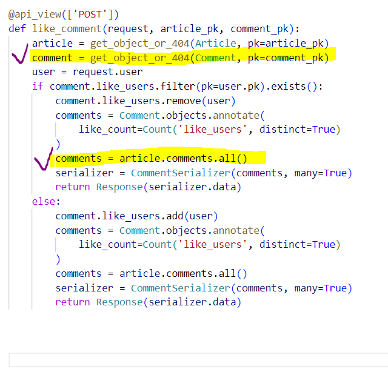

# 2022 Movie Website Project

SSAFY 1학기 최종 프로젝트 : 커뮤니티 기능을 갖춘 영화 추천 웹 서비스를 구현하며 작성하였습니다. 


### 1. 프로젝트 기간 및 목표

---

- 2022.05.17(화) ~ 2022.05.26(목)
- 영화 추천 알고리즘을 적용한 영화 커뮤니티 사이트 구현 


### 2. 팀 정보 및 업무 분담 내역

---

#### 서`상`균 박지`현의` `4`조 



| 이름   | 역할 | 업무 분담 내역                  |
| ------ | ---- | ------------------------------- |
| 서상균 | 팀장 | Back-end / Django 서버 구현     |
| 박지현 | 팀원 | Front-end / Vue 클라이언트 구현 |


### 3. 개발일지

---

| 날짜       | 진행 | 내용                                                         |
| ---------- | ---- | ------------------------------------------------------------ |
| 2022-05-16 | 기획 | 기능 기획                                                    |
| 2022-05-17 | 기획 | 기능 구체화, 디자인 컨셉 선정, 수집 필요한 데이터 정리       |
| 2022-05-18 | 기획 | API docs 구성, 목업 작성, 컴포넌트 구조 작성, 영화 데이터 수집 |
| 2022-05-19 | 기획 | 목업, DB 모델링, ERD 작성 완료, 영화 데이터 수집, Django 프로젝트 설정 |
| 2022-05-20 |      |                                                              |


### 4.  개발 툴

---

- Git을 통한 소스코드 버전 관리 및 협업 
- Jira를 통한 프로젝트 일정 및 자료 관리
  - 

- Figma를 통한 목업 작성
  - 

- Python Web Framework
  - Django 2.1.x
  - Python 3.6.x
- Progressive JavaScript Framework 
  - Vue 2.x


### 5. 프로젝트 컨셉 및 주요 기능 

---

#### 5-1. 컨셉

- 카지노 .. 

#### 5-2. 주요 기능

- 추천 알고리즘 
- 주요 기능(MVP)


### 6. 컴포넌트 구조

---



### 7. 데이터베이스 모델링

---




#### 7-1. Accounts 모델 클래스 user

- (1:N)
- (M:M)

```python
```


### 8. 주요 기능 

---


### 오류가 키워 준 지식

---

#### 

- module을 나눠서 사용하면 다른 파일들은 `new Vuex.Store` 붙일 필요 없이 그냥 `export default ({})` 로 작성하면 된다! 이미 index가 생성해뒀기 때문! 
  - 
  - Uncaught Error가 뜬다!

---

- template 부터 위에서 아래로 렌더링 된다 .. props 데이터를 템플릿에서 쓰려고해서 문제가 생겼다 .... 큰 문제가 .. 
  - 이전 코드 : getters를 써서 state에 있는 pk 값을 data에 집어넣어서 사용하려고 함. 
    - undefined 오류가 뜸
    -  
    - 이름만 다르고 같은 오류가 뜸
    - **속성이 선언되지 않았는데 화면에 렌더링 되려고 했습니다**
  - 해결 방법 
    - 1. props에 userPk 값을 넣어서 받아올 수 있나 확인
      2. main view 에서 router-link params를 1번에서 성공한 값으로 넣어서 path가 문제인지 데이터 값이 문제인지 체크
      3. 데이터가 문제였다 ... 
      4. data에 담아서 넘기던 코드를 computed를 사용해 넘겨줌! 
      5. params값이 string으로 들어가는 문제 발생 ...
    - 코드 싹 지우고 .... profile 페이지에서 userPk 싹 빼서 처리
      - dj-rest-auth  사용해서 request에 이미 정보가 담겨있었다. 

---

- Pk 값에 대체 무슨 문제가 있던 걸까요 
  - 
  - article 작성 됨 => article Detail로 이동해야하는데 articlePk값이 없다고 한다 ,,, 하지만 getters.article.id 에 분명 값이 잘 들어있고요? 
  - 모든 코드에서 pk값이 말썽을 부리는 문제가 발생합니다 ......

---

- 댓글이 생성은 되는데요? 이게 좀 이상합니다
  - 
  - 1. 댓글을 새로 작성하면 위처럼 댓글들이 다 뜬다 (방금 새로 작성한 댓글은 제외....)
    2. 새고하면 다른 댓글들은 다 지워지고 => 해당 article에 속한 댓글만 잘 뜬다... 
    3. 생성 / 수정 / 좋아요에서 같은 문제 발생
  - 수정이 진행되면 수정된 정보를 보내줘야하는데 시리얼라이저 맨 앞에서 받아온 애들을 넘겨주면 수정이 반영이 안된다... 그래서 return 해주기 전에 수정된 정보들을 다시 받아서 serialize 시킨 후 반환!
  - 

---

- Pk값을 찾지 못할 때는 내가 값을 제대로 찾아서 넣어줬는지 확인하자... 

---

- 새로고침 할 때 NavigationDuplicated 오류가 뜬다.. 

  - 기능은 작동하지만 자꾸 오류가 나서 ..... 이런식으로 catch err => err 해줬다... (aka 비둘기코드)
  - Error Handling
    - 에러 핸들링 미들웨어라고한다 .. 

  ```js
          router.push({
            name: "moviesearchview",
            params: {
              keyword: getters.keyword,
            },
          }).catch(err => err)
  ```

  

